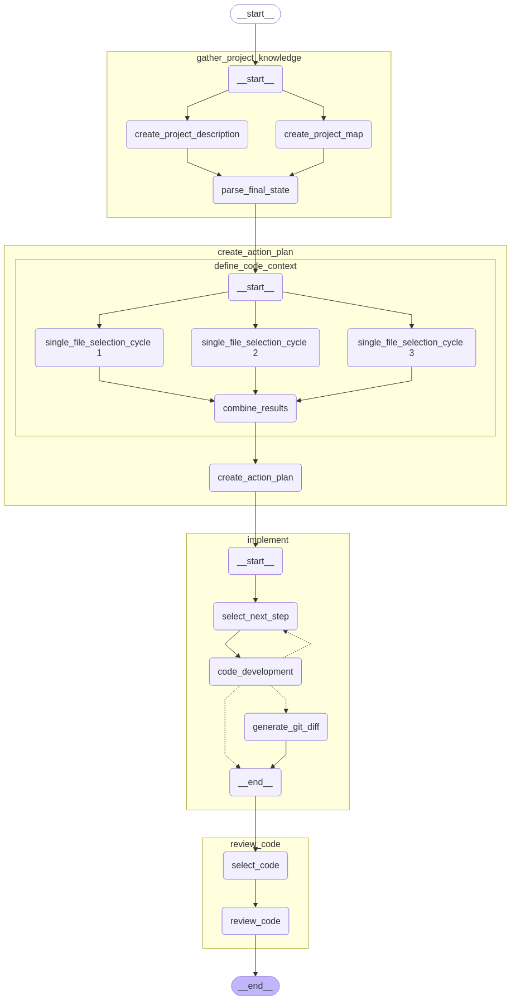

# DeepNext

Your AI-powered software engineering assistant that automates issue resolution from analysis to pull request.

DeepNext is an advanced AI system that automatically analyzes code repositories, designs solutions, and implements fixes for software engineering tasks using Large Language Models, saving developers hours of repetitive work.

## Quick start

### Installation

```bash
# Clone the repository
git clone https://github.com/stxnext/deep-next.git
cd deep-next

# Install dependencies
make install_venv
```

### Example usage

```bash
# Process a single issue
poetry run python -m deep_next.core.entrypoint \
  --problem-statement "Add type hints in file.py" \
  --hints "The error occurs in file.py" \
  --root_dir /path/to/repository
```


## How it works

DeepNext operates through a pipeline that handles the entire software engineering process:



### 1. Gather Project Knowledge
- **Inputs**: Repository **root directory**
- **Process**:
  - Creates comprehensive project description by analyzing READMEs, configuration files, and code structure
  - Generates project map showing directory organization and component relationships
- **Outputs**: Consolidated **project knowledge** description

### 2. Create Detailed Design
- **Inputs**: **Project knowledge** and **issue description**
- **Process**:
  - Selects relevant files through multiple parallel analysis cycles
  - Uses AI to deduce which files need modifications
  - Combines results from multiple analysis passes for higher accuracy
  - Creates detailed, structured solution design with specific file changes
- **Outputs**: **Action plan** with ordered steps for implementation

### 3. Implement Changes
- **Inputs**: **Action plan** and access to the files for modification
- **Process**:
  - Develops edits for each file with proper context and formatting
  - Applies changes using exact matching first, then fuzzy matching for resilience
  - Generates comprehensive git diff for review
- **Outputs**: Complete implementation as **git diff** or **pull/merge request**

The project is structured as a monorepo with specialized components:
- **Apps**: Main DeepNext application for Github/GitLab integration (app/)
- **Libs**: Core processing logic, connectors for external services, and common utilities 
    - `core/`: Main logic for analyzing repositories and generating solutions
    - `connectors/`: Integration with external services
    - `common/`: Shared utilities and configurations

## GitHub/GitLab integration

Running as a service to automatically process issues:

```bash
# Start the DeepNext app in Docker
make app_docker_build
make app_docker_run
```

Configuration for GitLab:
```json
{
    "project_name": "deep_next",
    "gitlab": {
        "project_id": "<project_id>",
        "base_url": "<url>",
        "access_token": "<access_token>"
    },
    "git": {
        "ref_branch": "develop",
        "repo_url": "<repo_url.git>",
        "label": "git_label"
    }
}
```

## Configuration

DeepNext supports multiple LLM providers:
- OpenAI
- AWS Bedrock (Claude, Mistral, and others)

Create an `llm-config.yaml` file based on the example provided to configure model preferences for each pipeline stage.

For tracking and metrics, DeepNext integrates with LangSmith. Set up your credentials in the `.env` file.

## Roadmap

- **May 2025**: First public release
- Future enhancements:
  - Improved code generation accuracy
  - Support for more programming languages

## Why choose DeepNext?

- **End-to-End Automation**: Complete pipeline from issue to merge request
- **Multiple LLM Support**: Works with various models to fit your needs
- **Flexible Integration**: Compatible with GitHub, GitLab and AWS
- **Customizable**: Configure different models for different pipeline stages
- **Open Source**: MIT-licensed and community-driven
