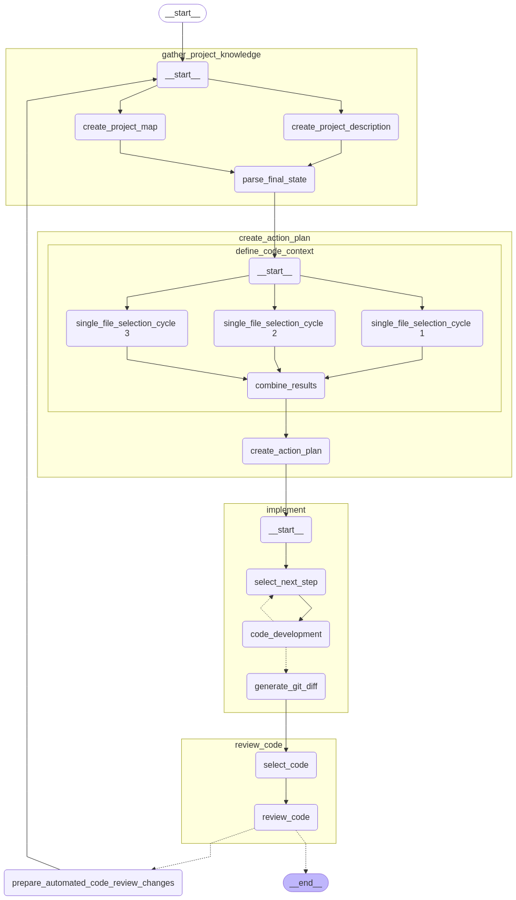

# DeepNext Architecture

DeepNext operates through a pipeline that handles the entire software engineering process:

## Pipeline Components

### 1. Gather Project Knowledge
- **Inputs**: Repository **root directory**
- **Process**:
  - Creates comprehensive project description by analyzing READMEs, configuration files, and code structure
  - Generates project map showing directory organization and component relationships
- **Outputs**: Consolidated **project knowledge** description

### 2. Create Action Plan
- **Inputs**: **Project knowledge** and **issue description**
- **Process**:
  - Selects relevant files through multiple parallel analysis cycles
  - Uses AI to deduce which files need modifications
  - Combines results from multiple analysis passes for higher accuracy
  - Creates detailed, structured solution design with specific file changes
- **Outputs**: **Action plan** with ordered steps for implementation

### 3. Implement Changes
- **Inputs**: **Action plan** and access to the files for modification
- **Process**:
  - Develops edits for each file with proper context and formatting
  - Applies changes using exact matching first, then fuzzy matching for resilience
  - Generates comprehensive git diff for review
- **Outputs**: Complete implementation as **git diff** or **pull/merge request**

## Project Structure

The project is structured as a monorepo with specialized components:
- **Apps**: Main DeepNext application for Github/GitLab integration (app/)
- **Libs**: Core processing logic, connectors for external services, and common utilities
    - `core/`: Main logic for analyzing repositories and generating solutions
    - `connectors/`: Integration with external services
    - `common/`: Shared utilities and configurations

[Back to Home](./index.html)
