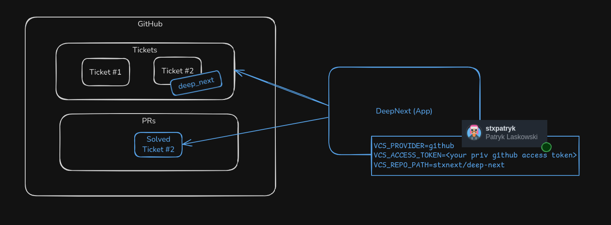

# Getting Started

## Requirements

- Python 3.11
- Poetry 1.8.2
- Access to an LLM provider (OpenAI or AWS Bedrock)
- Make sure public SSH key (e.g. `~/.ssh/id_rsa.pub`) is added to GitHub (access to repo download)
gi
## Installation

```bash
# Clone the repository
git clone git@github.com:stxnext/deep-next.git
cd deep-next

# Install dependencies
make install_venv

# Test the installation
make test_unit
```

```.dotenv
# .env
OPENAI_API_KEY=<your api key>
```

```bash
# Make sure LLM setup is configured properly
# echo "OPENAI_API_KEY=<your api key>" >> .env
make test_core_llm
```

## Example CLI Usage (core pipeline)

```bash
git status

poetry run python libs/core/deep_next/core/entrypoint.py  \
  --problem-statement "Add hello-world feature to core pipeline CLI so that it will print greetings. Make the CLI ok with passing only the hello-world flag. Add feature description to README." \
  --hints "..." \
  --root-dir "$(pwd)"

git status
```

## App run (GitHub connected)



```.dotenv
# This is .env

# OpenAI support (required)
OPENAI_API_KEY=<your api key>

# VCS connector setup (required to connect core pipeline with VCS)
VCS_PROVIDER=github
VCS_ACCESS_TOKEN=<your Github access token>
VCS_REPO_PATH=stxnext/deep-next
```

> Note: Selected scopes for GitHub: project, repo, user, write:discussion

```bash
poetry run python apps/app/deep_next/app/entrypoint_scheduled.py
```

## Observability (LangSmith | Langfuse) and Slack notifications

Few additional treats configured via `.env`

```dotenv
# Langsmith observability (optional)
LANGSMITH_TRACING=true
LANGSMITH_ENDPOINT="https://api.smith.langchain.com"
LANGSMITH_API_KEY="<your api key>"
LANGSMITH_PROJECT="DeepNext"
```

```dotenv
# Langfuse observability (optional)
LANGFUSE_HOST="https://cloud.langfuse.com"
LANGFUSE_PUBLIC_KEY="<your api key>"
```

```dotenv
# Slack notifications from app (optional)
SLACK_NOTIFICATIONS=true
SLACK_BOT_TOKEN="<your bot token>"
SLACK_CHANNEL="deepnext-ops"
```


[Back to Home](./index.html)
